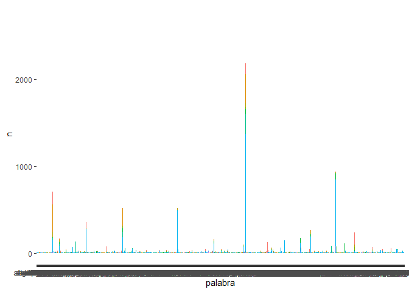

Análisis Inversión Obras Públicas CHile
================

En este documento realizaremos un análisis de las inversiones realizadas por el *Ministerio de Obras Públicas de Chile* en el periodo 2011-2017.

Primero cargamos las librerías que se utilizarán en este ejercicio.

``` r
library(dplyr) # manejo de datos
library(ggplot2) # visualización
library(ggridges) # más opciones de visualización
library(stringr) # manejo de variables "character"
library(forcats) # manejo de variables "factor"
library(readxl) # leer Excel
library(httr) # Leer info de internet
library(tidytext) # Análisis de texto
library(stopwords) # Complementaria a análisis de texto
library(kableExtra) # tablas
```

La informacióna utilizar está disponible en la web de datos abiertos del gobierno de Chile (<http://datos.gob.cl>) por lo que podemos acceder a esta a través de una URL. Luego de descargar los datos desde la web procedemos a cargar estos a nuestra sesión de R.

``` r
url <- "http://datos.gob.cl/dataset/104d1ebf-4d1b-4c3d-af9e-e85e5bbf1fc9/resource/3fe6aa75-b611-48bb-ae94-abf745bc0553/download/detalleinversionhistoricamop2011-2019.xlsx"
GET(url, write_disk(tf <- tempfile(fileext = ".xlsx")))
```

    ## Response [http://datos.gob.cl/dataset/104d1ebf-4d1b-4c3d-af9e-e85e5bbf1fc9/resource/3fe6aa75-b611-48bb-ae94-abf745bc0553/download/detalleinversionhistoricamop2011-2019.xlsx]
    ##   Date: 2019-10-16 14:28
    ##   Status: 200
    ##   Content-Type: application/vnd.openxmlformats-officedocument.spreadsheetml.sheet
    ##   Size: 675 kB
    ## <ON DISK>  C:\Users\PABLO~1.AGU\AppData\Local\Temp\RtmpKmOkYN\file2a1c1d0c6d34.xlsx

``` r
datos <- read_excel(tf)
```

``` r
str(datos)
```

    ## Classes 'tbl_df', 'tbl' and 'data.frame':    9367 obs. of  8 variables:
    ##  $ AÑO                               : num  2011 2011 2011 2011 2011 ...
    ##  $ REGIÓN                            : chr  "Arica y Parinacota" "Arica y Parinacota" "Arica y Parinacota" "Arica y Parinacota" ...
    ##  $ SERVICIO                          : chr  "Dirección de Arquitectura" "Dirección de Obras Hidráulicas" "Dirección de Obras Hidráulicas" "Dirección de Obras Hidráulicas" ...
    ##  $ PROVINCIA                         : chr  "ARICA" "PARINACOTA" "ARICA" "ARICA" ...
    ##  $ COMUNA                            : chr  "ARICA" "PUTRE" "ARICA" "ARICA" ...
    ##  $ BIP                               : chr  "30088379-0" "30034648-0" "30034659-0" "30069191-0" ...
    ##  $ NOMBRE                            : chr  "AMPLIACION OFICINAS M.O.P. EDIFICIO SERVICIOS PUBLICOS ARICA, ARTURO PRAT 305, ARICA" "CONSTRUCCION EMBALSE LIVILCAR VALLE DE AZAPA, COMUNA DE ARICA" "CONSTRUCCION EMBALSE CHIRONTA VALLE DEL LLUTA" "CONSTRUCCION INFRAESTRUCTURA EN CAUCE URBANO RÍO SAN JOSÉ ARICA" ...
    ##  $ INVERSIÓN (MILES DE $ DE CADA AÑO): num  1121062 23272 770137 498645 25805 ...

``` r
head(datos)
```

    ## # A tibble: 6 x 8
    ##     AÑO REGIÓN  SERVICIO  PROVINCIA  COMUNA BIP   NOMBRE   `INVERSIÓN (MIL~
    ##   <dbl> <chr>   <chr>     <chr>      <chr>  <chr> <chr>               <dbl>
    ## 1  2011 Arica ~ Direcció~ ARICA      ARICA  3008~ AMPLIAC~          1121062
    ## 2  2011 Arica ~ Direcció~ PARINACOTA PUTRE  3003~ CONSTRU~            23272
    ## 3  2011 Arica ~ Direcció~ ARICA      ARICA  3003~ CONSTRU~           770137
    ## 4  2011 Arica ~ Direcció~ ARICA      ARICA  3006~ CONSTRU~           498645
    ## 5  2011 Arica ~ Direcció~ ARICA      ARICA  3006~ CONSTRU~            25805
    ## 6  2011 Arica ~ Direcció~ ARICA      ARICA  3007~ CONSTRU~           233856

``` r
df <- datos %>%
  select(-BIP) %>%
  rename(
    Anio = AÑO,
    Region = REGIÓN,
    Servicio = SERVICIO,
    Provincia = PROVINCIA,
    Comuna = COMUNA,
    Nombre = NOMBRE,
    Inversion = `INVERSIÓN (MILES DE $ DE CADA AÑO)`
  ) %>% 
  mutate(Inversion = round(Inversion / 1000000, 1),
         Provincia = str_to_sentence(Provincia),
         Nombre = str_to_lower(Nombre),
         Comuna = str_to_sentence(Comuna),
         Region = as_factor(Region))
```

``` r
df %>% 
  group_by(Anio) %>% 
  summarise(Inversion = sum(Inversion)) %>% 
  ggplot(aes(x = Anio, y = Inversion, label = Inversion)) +
  scale_x_continuous(breaks = c(2011:2017)) +
  geom_line(size = 1.2, col = "blue") +
  geom_label() +
  ylim(0, 1600) +
  labs(title = "Inversión en OOPP en el periodo 2011-2017 (MM CLP)", 
       subtitle = "Desglose por año",
       x = "",
       y= "") +
  theme_minimal()
```


``` r
df %>% 
  group_by(Region) %>% 
  summarise(Inversion = sum(Inversion)) %>% 
  ggplot(aes(x = reorder(Region, Inversion), y = Inversion, label = Inversion)) +
  geom_col(fill = "red") +
  coord_flip() +
  ylim(0, 1150) + 
  geom_text(hjust = -0.1, size = 3) +
  labs(title = "Inversión en OOPP en el periodo 2011-2017 (MM CLP)", 
       subtitle = "Desglose por región",
       x = "",
       y = "") +
  theme_minimal() +
  theme(axis.text.x = element_blank())
```


``` r
df %>% 
  group_by(Region, Anio) %>% 
  summarise(Inversion = sum(Inversion)) %>% 
  ggplot(aes(x = Anio, y = Inversion, label = Inversion)) + 
  facet_wrap(~ Region, nrow = 4) +
  geom_line(col = "blue") +
  geom_point() +
  ylim(0, 300) + 
  geom_text(size = 2, vjust = -0.4) +
  labs(title = "Inversión en OOPP en el periodo 2011-2017 (MM CLP)", 
       subtitle = "Desglose por región y año",
       x = "",
       y = "") +
  theme_minimal() +
  theme(axis.text.x = element_blank(),
        axis.text.y = element_blank())
```


``` r
df %>% 
  unnest_tokens(palabra, Nombre) %>% 
  mutate(palabra = str_replace(palabra, "[:punct:]", " "),
         palabra = str_replace(palabra, "\\w*[0-9]+\\w*\\s*", " "),
         palabra = stringi::stri_trans_general(palabra, "Latin-ASCII"),
         nchar = nchar(palabra)) %>%
  filter(!is.na(palabra) & 
         !palabra %in% c("y", "yy", "i", "ii", "iii", "iv", "v", "vi", "vii", "viii", "ix", "x", "xi", "xii", "xiv", "", " ", "apr", "ano", "anos", "san"),
         !palabra %in% stopwords(language = "es"),
         nchar > 2) %>% 
  count(Servicio, palabra, sort = TRUE) %>% 
  group_by(Servicio) %>% 
  mutate(palabra = reorder(palabra, n)) %>% 
  ggplot(aes(palabra, n, fill = Servicio)) +
  geom_col(show.legend = FALSE)
```


